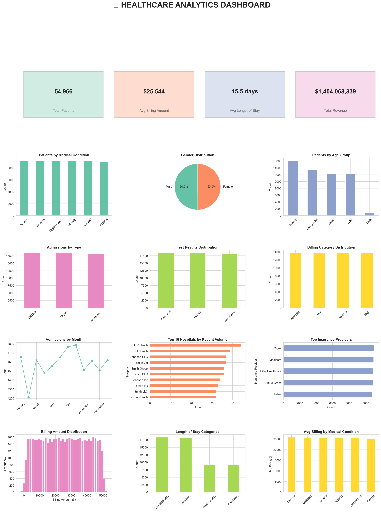

# 🏥 ETL Healthcare Project

An end-to-end ETL (Extract, Transform, Load) project that demonstrates the complete data processing workflow using Python. This project cleans, transforms, and analyzes healthcare data to generate meaningful insights and visualizations.

---

## 📌 Project Overview

This project performs the following tasks:

- Extracts healthcare data from an Excel dataset
- Cleans and preprocesses the data
- Handles missing values and duplicates
- Transforms the dataset for analysis
- Performs Exploratory Data Analysis (EDA)
- Generates visualizations and business insights

---

## 🛠️ Technologies Used

- Python
- Pandas
- NumPy
- Matplotlib
- Seaborn
- Jupyter Notebook
- Excel

---

## 📂 Project Structure

```
ETL-Healthcare-Project/
│
├── ETL_Healthcare_Project.ipynb
├── healthcare_dataset.xlsx
├── healthcare_dashboard.png
└── README.md
```

---

## ⚙️ ETL Workflow

### 1. Extract
- Imported healthcare dataset from Excel.

### 2. Transform
- Cleaned missing values
- Removed duplicate records
- Converted data types
- Standardized column names
- Prepared data for analysis

### 3. Load
- Generated cleaned dataset
- Performed exploratory data analysis
- Created visualizations and dashboard

---

## 📊 Dashboard



---

## 📈 Key Analysis

- Patient demographics
- Medical conditions
- Billing analysis
- Hospital performance
- Admission trends
- Treatment insights

---

## 🚀 How to Run

1. Clone this repository

```bash
git clone https://github.com/vaibhavpaunikar/Etl-Healthcare-Project.git
```

2. Install the required libraries

```bash
pip install pandas numpy matplotlib seaborn openpyxl
```

3. Open the notebook

```bash
jupyter notebook ETL_Healthcare_Project.ipynb
```

---

## 📌 Future Improvements

- Build an interactive Power BI dashboard
- Deploy using Streamlit
- Connect to SQL database
- Automate the ETL pipeline

---

## 👨‍💻 Author

**Vaibhav Paunikar**

- LinkedIn: www.linkedin.com/in/vaibhav-paunikar
- GitHub: https://github.com/vaibhavpaunikar

---

⭐ If you found this project useful, consider giving it a star.
